## Performance Testing: MariaDB vs ClickHouse

#### 1. Setup

- MariaDB: 10.98.15.8
  - user: root
- ClickHouse: 10.98.15.9
  - user: default

- Để clickhouse host kết nối được tới mariadb cần cấu hình trên mariadb host:

  - Sửa lại `bind-address` thành `0.0.0.0` trong `/etc/mysql/mariadb.conf.d/50-server.cnf`


  - Tạo user mariadb:
    ```sql
    CREATE USER 'root'@'10.98.15.9' IDENTIFIED BY 'juniper@123';
    GRANT ALL PRIVILEGES ON *.* TO 'root'@'10.98.15.9' WITH GRANT OPTION;
    FLUSH PRIVILEGES;
    ```

- Disable cache

  ```sql
  SET SESSION query_cache_type=0;
  ```

  

- Migrate data (mariadb to clickhouse):

```bash
# Run below commands on clickhouse host

apt-get install python3-pip

pip install clickhouse-mysql # apt-get install pkg-config python3-dev default-libmysqlclient-dev build-essential (if you get error missing package)

clickhouse-mysql --src-server-id 1 --migrate-table --src-wait --nice-pause 1 --src-host=10.98.15.8 --src-port 3306 --src-user=root --src-password=juniper@123 --src-schemas icinga --src-tables alert_history_host,alert_history_service,icinga_commands,icinga_commenthistory,icinga_comments,icinga_configfiles,icinga_configfilevariables,icinga_conninfo,icinga_contact_addresses,icinga_contact_notificationcommands,icinga_contactgroup_members,icinga_contactgroups,icinga_contactnotificationmethods,icinga_contactnotifications,icinga_contacts,icinga_contactstatus,icinga_customvariables,icinga_customvariablestatus,icinga_dbversion,icinga_downtimehistory,icinga_endpoints,icinga_endpointstatus,icinga_eventhandlers,icinga_externalcommands,icinga_flappinghistory,icinga_host_contactgroups,icinga_host_contacts,icinga_host_parenthosts,icinga_hostchecks,icinga_hostdependencies,icinga_hostescalation_contactgroups,icinga_hostescalation_contacts,icinga_hostescalations,icinga_hostgroup_members,icinga_hostgroups,icinga_hosts,icinga_hoststatus,icinga_instances,icinga_logentries,icinga_notifications,icinga_objects,icinga_processevents,icinga_programstatus,icinga_runtimevariables,icinga_scheduleddowntime,icinga_service_contactgroups,icinga_service_contacts,icinga_servicechecks,icinga_servicedependencies,icinga_serviceescalation_contactgroups,icinga_serviceescalation_contacts,icinga_serviceescalations,icinga_servicegroup_members,icinga_servicegroups,icinga_services,icinga_servicestatus,icinga_systemcommands,icinga_timeperiod_timeranges,icinga_timeperiods,icinga_zones,icinga_zonestatus,notification_history_host,notification_history_service,icinga_statehistory --dst-host=localhost --dst-user=default --dst-password=juniper@123 --with-create-database --dst-create-table --log-level=debug
```


#### 2. Testing

1. SLA report query

```sql
# SLA report query
SET @tmp:= -1;
SELECT COALESCE(SUM(CASE WHEN t1.state = 0 THEN t1.duration end), 0) as OK, COALESCE(SUM(CASE WHEN t1.state = 1 THEN t1.duration end), 0) as WARNING, COALESCE(SUM(CASE WHEN t1.state = 2 THEN t1.duration end), 0) as CRITICAL, COALESCE(SUM(CASE WHEN t1.state = 3 THEN t1.duration end), 0) as UNKNOWN FROM ( SELECT state, if(@tmp = -1,0, -UNIX_TIMESTAMP(state_time) + @tmp) as 'duration',         @tmp:=UNIX_TIMESTAMP(state_time) as dummy FROM icinga_statehistory WHERE object_id='203680' and state_time >= '2024-11-15 03:23:42' and state_time <= '2024-11-17 04:23:42'        order by state_time desc) AS t1;
```

```sql
# SLA report query ClickHouse
SELECT COALESCE(SUM(CASE WHEN t1.state = 0 THEN t1.duration end), 0) as OK, COALESCE(SUM(CASE WHEN t1.state = 1 THEN t1.duration end), 0) as WARNING, COALESCE(SUM(CASE WHEN t1.state = 2 THEN t1.duration end), 0) as CRITICAL, COALESCE(SUM(CASE WHEN t1.state = 3 THEN t1.duration end), 0) as UNKNOWN FROM (SELECT state, if(dummy = 0,0, -toUnixTimestamp(state_time) + dummy) as duration, lagInFrame(toUnixTimestamp(state_time), 1, 0) OVER (ORDER BY state_time DESC ROWS BETWEEN 1 PRECEDING AND 1 PRECEDING) as dummy FROM icinga_statehistory WHERE object_id='203680' and state_time >= '2024-11-15 03:23:42' and state_time <= '2024-11-17 04:23:42'
    order by state_time desc) AS t1;
```


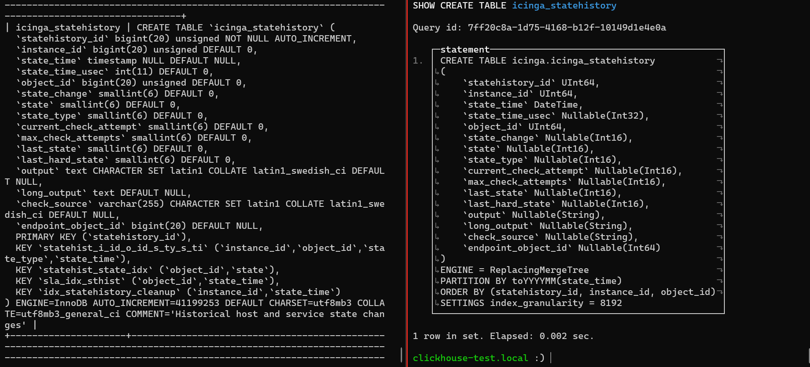

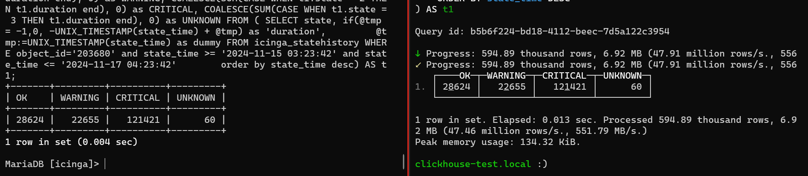


2. Notification History

```sql
# Notification History
SELECT
  n.start_time as Time,
  oc.name1 as Contact,
  oh.name1 as Host,
CASE
  WHEN n.notification_reason = 0 THEN
  CASE
      WHEN n.state = 0 THEN 'RECOVERY'
      WHEN n.state = 1 THEN 'DOWN'
      WHEN n.state = 2 THEN 'UNREACHABLE'
      ELSE n.state
  END
  WHEN n.notification_reason = 1 THEN
  CASE
    WHEN n.state = 1 THEN 'ACKNOWLEDGEMENT (DOWN)'
    WHEN n.state = 2 THEN 'ACKNOWLEDGEMENT (UNREACHABLE)'
  END
  WHEN n.notification_reason = 2 THEN
  CASE
    WHEN n.state = 0 THEN 'FLAPPINGSTART (UP)'
    WHEN n.state = 1 THEN 'FLAPPINGSTART (DOWN)'
    WHEN n.state = 2 THEN 'FLAPPINGSTART (UNREACHABLE)'
  END
  WHEN n.notification_reason = 3 THEN
  CASE
    WHEN n.state = 0 THEN 'FLAPPINGSTOP (UP)'
    WHEN n.state = 1 THEN 'FLAPPINGSTOP (DOWN)'
    WHEN n.state = 2 THEN 'FLAPPINGSTOP (UNREACHABLE)'
  END
  WHEN n.notification_reason = 5 THEN
  CASE
    WHEN n.state = 0 THEN 'DOWNTIMESTART (UP)'
    WHEN n.state = 1 THEN 'DOWNTIMESTART (DOWN)'
    WHEN n.state = 2 THEN 'DOWNTIMESTART (UNREACHABLE)'
  END
  WHEN n.notification_reason = 6 OR n.notification_reason = 7 THEN
  CASE
    WHEN n.state = 0 THEN 'DOWNTIMEEND (UP)'
    WHEN n.state = 1 THEN 'DOWNTIMEEND (DOWN)'
    WHEN n.state = 2 THEN 'DOWNTIMEEND (UNREACHABLE)'
  END
  WHEN n.notification_reason = 99 THEN
  CASE
    WHEN n.state = 0 THEN 'CUSTOM (UP)'
    WHEN n.state = 1 THEN 'CUSTOM (DOWN)'
    WHEN n.state = 2 THEN 'CUSTOM (UNREACHABLE)'
  END
END AS Type,
  occ.name1 AS Notification_Command,
  n.output AS Infomation

FROM
icinga_contactnotifications c
JOIN icinga_notifications n ON c.instance_id = n.instance_id AND c.notification_id = n.notification_id
JOIN icinga_objects oc ON c.contact_object_id = oc.object_id
JOIN icinga_objects oh ON n.object_id = oh.object_id
LEFT JOIN icinga_contactnotificationmethods cn ON cn.contactnotification_id = c.contactnotification_id
LEFT JOIN icinga_objects occ ON cn.command_object_id = occ.object_id
WHERE UNIX_TIMESTAMP(n.start_time) BETWEEN UNIX_TIMESTAMP('2023-11-15') AND UNIX_TIMESTAMP('2024-12-15') AND oh.objecttype_id = 1 AND oh.name1 in ('CSG-NDH_NDH_KCN_HOA_XA','CSG-QNH_DTU_YEN_THO_2','CSG-QNH_DTU_MAO_KHE_3','CSG-HDG_THA_THANH_HAI','CSG-QNH_DTU_VIET_DAN_2','CSG-TH_TGA_MAI_LAM_4','CSG-HDG_KMN_LONG_XUYEN_2','ME-CSR-HNI-C69.1---HN_BDH_04_LANG_HA','ME-CSR-HNI-C136.3---HN_BDH_BAO_TANG_B52','ME-CSR-HNI-C61.4---HN_DDA_LINH_QUANG','ME-CSR-HNI-C173.2---H2_MLH_YEN_NHAN','ME-CSR-HNI-C122.5---HN_DDA_PHAO_DAI_LANG')
AND n.notification_id > ((select max(notification_id) from icinga_notifications) - 400000000)
ORDER BY n.start_time desc;
```

```sql
# Notification History ClickHouse
SELECT
  n.start_time as Time,
  oc.name1 as Contact,
  oh.name1 as Host,
  CASE
    WHEN n.notification_reason = 0 THEN
      CASE
        WHEN n.state = 0 THEN 'RECOVERY'
        WHEN n.state = 1 THEN 'DOWN'
        WHEN n.state = 2 THEN 'UNREACHABLE'
        ELSE toString(n.state)
      END
    WHEN n.notification_reason = 1 THEN
      CASE
        WHEN n.state = 1 THEN 'ACKNOWLEDGEMENT (DOWN)'
        WHEN n.state = 2 THEN 'ACKNOWLEDGEMENT (UNREACHABLE)'
        ELSE ''
      END
    WHEN n.notification_reason = 2 THEN
      CASE
        WHEN n.state = 0 THEN 'FLAPPINGSTART (UP)'
        WHEN n.state = 1 THEN 'FLAPPINGSTART (DOWN)'
        WHEN n.state = 2 THEN 'FLAPPINGSTART (UNREACHABLE)'
        ELSE ''
      END
    WHEN n.notification_reason = 3 THEN
      CASE
        WHEN n.state = 0 THEN 'FLAPPINGSTOP (UP)'
        WHEN n.state = 1 THEN 'FLAPPINGSTOP (DOWN)'
        WHEN n.state = 2 THEN 'FLAPPINGSTOP (UNREACHABLE)'
        ELSE ''
      END
    WHEN n.notification_reason = 5 THEN
      CASE
        WHEN n.state = 0 THEN 'DOWNTIMESTART (UP)'
        WHEN n.state = 1 THEN 'DOWNTIMESTART (DOWN)'
        WHEN n.state = 2 THEN 'DOWNTIMESTART (UNREACHABLE)'
        ELSE ''
      END
    WHEN n.notification_reason = 6 OR n.notification_reason = 7 THEN
      CASE
        WHEN n.state = 0 THEN 'DOWNTIMEEND (UP)'
        WHEN n.state = 1 THEN 'DOWNTIMEEND (DOWN)'
        WHEN n.state = 2 THEN 'DOWNTIMEEND (UNREACHABLE)'
        ELSE ''
      END
    WHEN n.notification_reason = 99 THEN
      CASE
        WHEN n.state = 0 THEN 'CUSTOM (UP)'
        WHEN n.state = 1 THEN 'CUSTOM (DOWN)'
        WHEN n.state = 2 THEN 'CUSTOM (UNREACHABLE)'
        ELSE ''
      END
    ELSE ''
  END AS Type,
  occ.name1 AS Notification_Command,
  n.output AS Infomation
FROM
  icinga_contactnotifications c
JOIN icinga_notifications n ON c.instance_id = n.instance_id AND c.notification_id = n.notification_id
JOIN icinga_objects oc ON c.contact_object_id = oc.object_id
JOIN icinga_objects oh ON n.object_id = oh.object_id
LEFT JOIN icinga_contactnotificationmethods cn ON cn.contactnotification_id = c.contactnotification_id
LEFT JOIN icinga_objects occ ON cn.command_object_id = occ.object_id
WHERE toUnixTimestamp(n.start_time) BETWEEN toUnixTimestamp('2023-11-15') AND toUnixTimestamp('2024-12-15') 
  AND oh.objecttype_id = 1 
  AND oh.name1 IN ('CSG-NDH_NDH_KCN_HOA_XA','CSG-QNH_DTU_YEN_THO_2','CSG-QNH_DTU_MAO_KHE_3','CSG-HDG_THA_THANH_HAI','CSG-QNH_DTU_VIET_DAN_2','CSG-TH_TGA_MAI_LAM_4','CSG-HDG_KMN_LONG_XUYEN_2','ME-CSR-HNI-C69.1---HN_BDH_04_LANG_HA','ME-CSR-HNI-C136.3---HN_BDH_BAO_TANG_B52','ME-CSR-HNI-C61.4---HN_DDA_LINH_QUANG','ME-CSR-HNI-C173.2---H2_MLH_YEN_NHAN','ME-CSR-HNI-C122.5---HN_DDA_PHAO_DAI_LANG')
  AND n.notification_id > ((SELECT max(notification_id) FROM icinga_notifications) - 400000000)
ORDER BY n.start_time DESC;
```

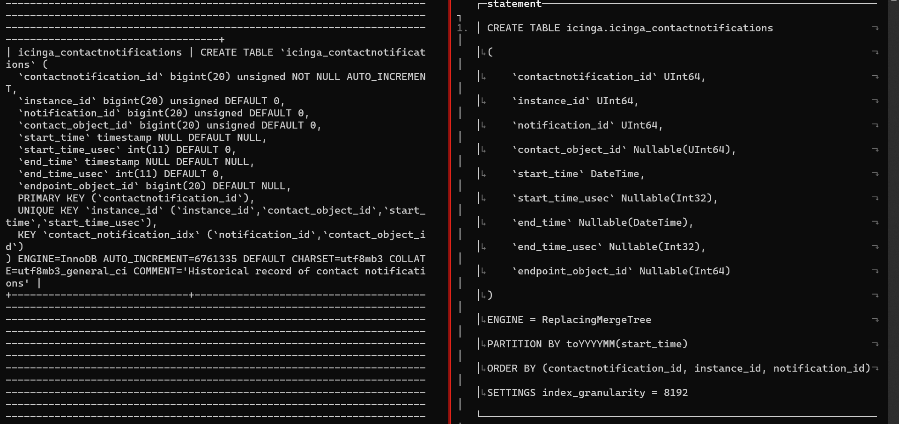

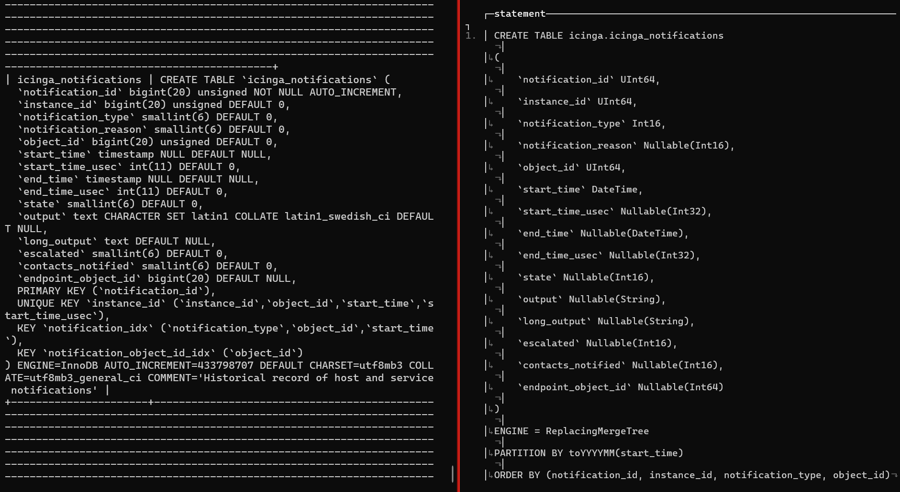

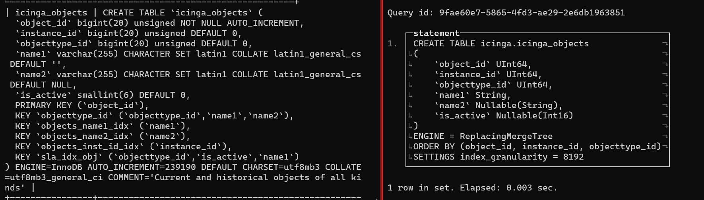

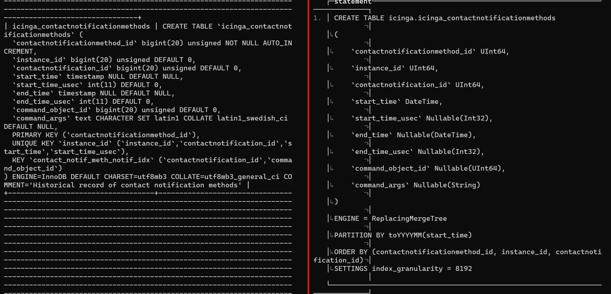

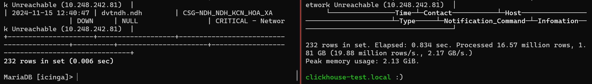


3. Alert History - Host

```sql
# Alert History - Host
SELECT    state_time as Time,   t4.name1 as Host,   t1.state AS State,   t1.state_type AS statetype,   t1.output as Description,   t1.check_source as Check_Source FROM icinga_statehistory t1 INNER JOIN icinga_hostgroup_members t2 on t1.object_id = t2.host_object_id INNER JOIN icinga_hostgroups t3 on t2.hostgroup_id = t3.hostgroup_id INNER JOIN icinga_objects t4 ON t1.object_id = t4.object_id WHERE t3.alias IN ('DBB_HPG', 'HNI') AND state_time >= '2023-11-15' AND state_time <= '2024-12-15';
```

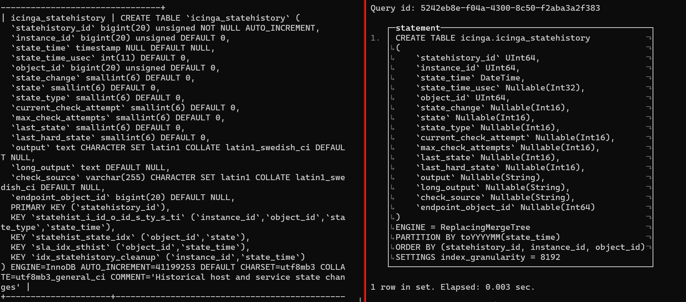

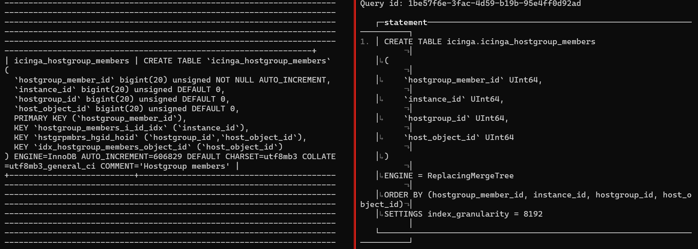

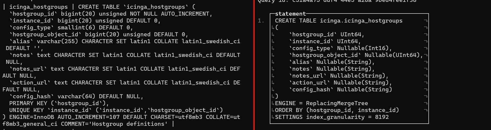

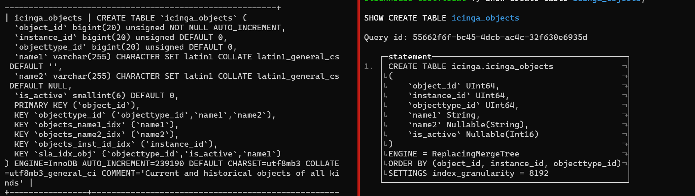

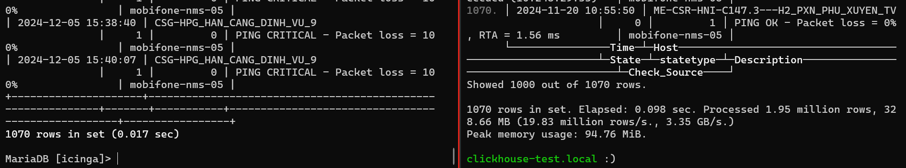


4. Alert History - Service

```sql
# Alert History - Service
SELECT    state_time as Time,   t2.display_name as Host,   t3.display_name as Service,   t1.state AS State,   t1.state_type AS statetype,   t1.output as Description,   t1.check_source as Check_Source FROM icinga_statehistory t1 INNER JOIN icinga_services t2 ON t1.object_id = t2.service_object_id INNER JOIN icinga_hosts t3 ON t2.host_object_id = t3.host_object_id INNER JOIN icinga_hostgroup_members t4 ON t2.host_object_id = t4.host_object_id INNER JOIN icinga_hostgroups t5 on t4.hostgroup_id = t5.hostgroup_id WHERE t5.alias IN ('DBB_HPG', 'HNI') AND state_time >= '2023-11-15' AND state_time <= '2024-12-15' LIMIT 50000;
```

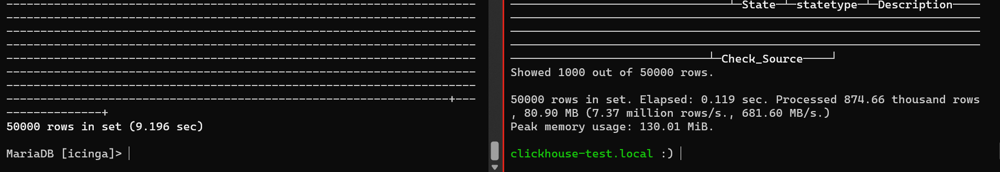


