## Performance Testing: MariaDB vs ClickHouse

#### 1. Setup

- MariaDB: 10.98.15.8
  - user: root
- ClickHouse: 10.98.15.9
  - user: default

- Để clickhouse host kết nối được tới mariadb cần cấu hình trên mariadb host:

  - Sửa lại `bind-address` thành `0.0.0.0` trong `/etc/mysql/mariadb.conf.d/50-server.cnf`


  - Tạo user mariadb:
    ```sql
    CREATE USER 'root'@'10.98.15.9' IDENTIFIED BY 'juniper@123';
    GRANT ALL PRIVILEGES ON *.* TO 'root'@'10.98.15.9' WITH GRANT OPTION;
    FLUSH PRIVILEGES;
    ```

- Disable cache

  ```sql
  # [mariadb]
  SET SESSION query_cache_type=0; # only in current session
  FLUSH QUERY CACHE;
  FLUSH TABLES;
  # [clickhouse]
  SYSTEM DROP MARK CACHE
  SYSTEM DROP UNCOMPRESSED CACHE
  ```
  
  ```xml
  # MariaDB config file
  [mysqld]
  query_cache_type = 0
  query_cache_size = 0
  # disable innoDB cache
  innodb_buffer_pool_size = 5M
  innodb_adaptive_hash_index = 0
  innodb_change_buffering = none
  
  # ClickHouse config file
  <clickhouse>
      <mark_cache_size>0</mark_cache_size>
      <uncompressed_cache_size>0</uncompressed_cache_size>
  </clickhouse>
  ```


- Migrate data (mariadb to clickhouse):

```bash
# Run below commands on clickhouse host

apt-get install python3-pip

pip install clickhouse-mysql # apt-get install pkg-config python3-dev default-libmysqlclient-dev build-essential (if you get error missing package)

clickhouse-mysql --src-server-id 1 --migrate-table --src-wait --nice-pause 1 --src-host=10.98.15.8 --src-port 3306 --src-user=root --src-password=juniper@123 --src-schemas icinga --src-tables alert_history_host,alert_history_service,icinga_commands,icinga_commenthistory,icinga_comments,icinga_configfiles,icinga_configfilevariables,icinga_conninfo,icinga_contact_addresses,icinga_contact_notificationcommands,icinga_contactgroup_members,icinga_contactgroups,icinga_contactnotificationmethods,icinga_contactnotifications,icinga_contacts,icinga_contactstatus,icinga_customvariables,icinga_customvariablestatus,icinga_dbversion,icinga_downtimehistory,icinga_endpoints,icinga_endpointstatus,icinga_eventhandlers,icinga_externalcommands,icinga_flappinghistory,icinga_host_contactgroups,icinga_host_contacts,icinga_host_parenthosts,icinga_hostchecks,icinga_hostdependencies,icinga_hostescalation_contactgroups,icinga_hostescalation_contacts,icinga_hostescalations,icinga_hostgroup_members,icinga_hostgroups,icinga_hosts,icinga_hoststatus,icinga_instances,icinga_logentries,icinga_notifications,icinga_objects,icinga_processevents,icinga_programstatus,icinga_runtimevariables,icinga_scheduleddowntime,icinga_service_contactgroups,icinga_service_contacts,icinga_servicechecks,icinga_servicedependencies,icinga_serviceescalation_contactgroups,icinga_serviceescalation_contacts,icinga_serviceescalations,icinga_servicegroup_members,icinga_servicegroups,icinga_services,icinga_servicestatus,icinga_systemcommands,icinga_timeperiod_timeranges,icinga_timeperiods,icinga_zones,icinga_zonestatus,notification_history_host,notification_history_service,icinga_statehistory --dst-host=localhost --dst-user=default --dst-password=juniper@123 --with-create-database --dst-create-table --log-level=debug
```


#### 2. ClickHouse supported filters (WHERE clause) but mariadb does not

- `match(string, pattern)`: Returns whether string `string` matches the regular expression `pattern`

  ```sql
  select check_source from icinga_statehistory where match(check_source, '^m.*')
  ```

- `ilike`:  for searching simple words (same as `like`) but case-insensitive.

- `multiIf(cond_1, then_1, cond_2, then_2,...)`: alternative for `case when` , better performance in ClickHouse

- `sumIf(column, cond)`, `countIf(cond)`, `avgIf(x, cond)`, `quantilesTimingIf(level1, level2)(x, cond)`, `argMinIf(arg, val, cond)`: The suffix -If can be appended to the name of any aggregate function.

- `has(array, value)`: Checks if an array contains a specific value

- `indexOf(array, value)`: Finds the index (1-based) of a value in an array

- `length(array)`: Returns the number of elements in an array

- `greatCircleDistance()`: Computes the shortest distance (in meters) between two geographical points using latitude and longitude

- `JSONExtract()`,`JSONExtractInt()`, `JSONExtractString()`: Extracts a value from a JSON string with a specified type

- `tupleElement(tuple, index)`: Extracts an element from a tuple based on its index (1-based)

  

#### 3. Testing

**SUMMARY** (the queries below have disabled caching, but the OS cache remains active)

| Queries                                                      | Filters                                                      | MariaDB | ClickHouse |
| ------------------------------------------------------------ | ------------------------------------------------------------ | ------- | ---------- |
| **SLA Report**<br />Table:<br /> `icinga_statehistory`<br />(3,276,715 rows) | `object_id`: 203680 & `state_time` in 2 months <br />(4247 rows) | 0.184s  | **0.010s** |
|                                                              | `object_id`: 203680 & `state_time` in 5 months<br />(4334 rows) | 0.173s  | **0.012s** |
|                                                              | `object_id`: 60747 & `state_time` in 2 months <br />(28,776 rows) | 0.878s  | **0.012s** |
|                                                              | `object_id`: 60747 & `state_time` in 5 months <br />(67,996 rows) | 2.004s  | **0.019s** |
| **Notification History**<br />Tables:<br />`icinga_contactnotifications`<br />`icinga_notifications`<br />`icinga_objects`<br />`icinga_contactnotificationmethods`<br />(1,098,325 rows) |                                                              |         |            |
| **Alert History - Host**<br />Tables:<br />`icinga_statehistory`<br />`icinga_hostgroup_members`<br />`icinga_hostgroups`<br />`icinga_objects`<br />(19,349 rows) | `alias` in ('DBB_HPG', 'HNI') & `state_time` in 1 year<br />(1070 rows) | 0.193s  | **0.102**  |
|                                                              | `alias` IN ('DBB_HPG', 'HNI') & `state_time` in 1 year<br />(1070 rows)<br />order by Time | 0.164s  | **0.097s** |
| **Alert History - Service**<br />Tables:<br />`icinga_statehistory`<br />`icinga_services`<br />`icinga_hosts`<br />`icinga_hostgroup_members`<br />`icinga_hostgroups`<br />(8,507,148 rows) | `alias` in ('DBB_HPG', 'HNI') & `state_time` in 1 year<br />(474,338 rows) | 2m46.4s | **0.421s** |
|                                                              | `alias` in ('DBB_HPG', 'HNI') & `state_time` in 1 year<br /> order by `Time`<br />(474,338 rows) | 2m48.5s | **0.584s** |
|                                                              | `alias` in ('DBB_HPG', 'HNI') & `state_time` in 1 year<br /> limit 50000<br />(50,000 rows) | 11.021s | **0.102s** |
|                                                              | `alias` in ('DBB_HPG', 'HNI') & `state_time` in 1 year<br />order by `Time`<br />limit 50000<br />(50,000 rows) | 2m46.9s | **0.375s** |


1. SLA report query

```sql
# SLA report query MariaDB
SET @tmp:= -1; SELECT SQL_NO_CACHE COALESCE(SUM(CASE WHEN t1.state = 0 THEN t1.duration end), 0) as OK, COALESCE(SUM(CASE WHEN t1.state = 1 THEN t1.duration end), 0) as WARNING, COALESCE(SUM(CASE WHEN t1.state = 2 THEN t1.duration end), 0) as CRITICAL, COALESCE(SUM(CASE WHEN t1.state = 3 THEN t1.duration end), 0) as UNKNOWN FROM ( SELECT state, if(@tmp = -1,0, -UNIX_TIMESTAMP(state_time) + @tmp) as 'duration',         @tmp:=UNIX_TIMESTAMP(state_time) as dummy FROM icinga_statehistory WHERE object_id='203680' and state_time >= '2024-11-15 03:23:42' and state_time <= '2024-11-17 04:23:42'        order by state_time desc) AS t1;
```

```sql
# SLA report query ClickHouse
SELECT
    sumIf(duration, state = 0) AS OK,
    sumIf(duration, state = 1) AS WARNING,
    sumIf(duration, state = 2) AS CRITICAL,
    sumIf(duration, state = 3) AS UNKNOWN
FROM
(
    SELECT
        state,
        if(dummy = 0, 0, dummy - toUnixTimestamp(state_time)) AS duration,
        lagInFrame(toUnixTimestamp(state_time), 1, 0) OVER (ORDER BY state_time DESC ROWS BETWEEN 1 PRECEDING AND 1 PRECEDING) AS dummy
    FROM icinga_statehistory
    WHERE (object_id = '203680') AND ((state_time >= '2024-11-15 03:23:42') AND (state_time <= '2024-11-17 04:23:42'))
) AS t1 SETTINGS use_query_cache = 0
```

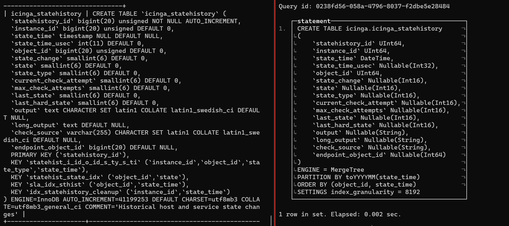

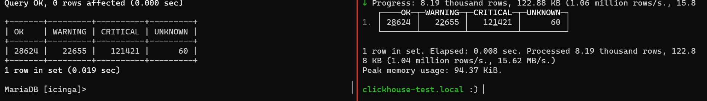

```sql
select count(*) from icinga_statehistory;
```

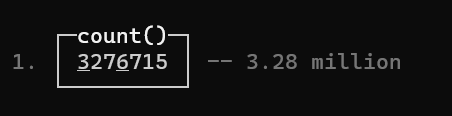

We only have data which have `state_time` in range 11/2024 - 03/2025.

Here are the number of rows corresponding to each `object_id` in each month:

```sql
# ClickHouse 
SELECT
    object_id,
    sumIf(1, toYYYYMM(state_time) = 202411) AS "2024-11",
    sumIf(1, toYYYYMM(state_time) = 202412) AS "2024-12",
    sumIf(1, toYYYYMM(state_time) = 202501) AS "2025-01",
    sumIf(1, toYYYYMM(state_time) = 202502) AS "2025-02",
    sumIf(1, toYYYYMM(state_time) = 202503) AS "2025-03",
    "2024-11" + "2024-12" + "2025-01" + "2025-02" + "2025-03" AS "Total"
FROM icinga_statehistory
GROUP BY object_id
ORDER BY Total SETTINGS use_query_cache = 0;
```

We will benchmark 2 `object_id`: `203680` and `60747` in 2 ranges of `state_time`: 2 months (11 - 12/2024) and 5 months (11/2024 - 3/2025)

a. `203680`

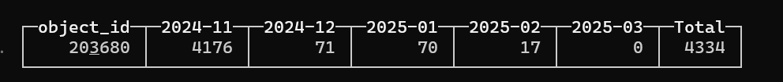

- 2 months

  ```sql
  # ...
  WHERE object_id='203680' and state_time >= '2024-11-01 00:00:00' and state_time <= '2024-12-31 23:59:59'
  ```

  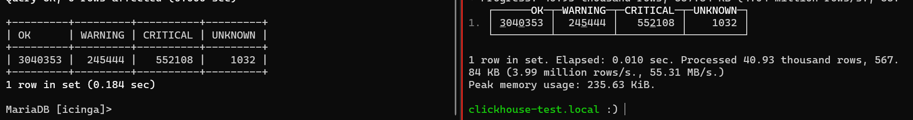

- 5 months

  ```sql
  # ...
  WHERE object_id='203680' and state_time >= '2024-11-01 00:00:00' and state_time <= '2025-03-31 23:59:59'
  ```

  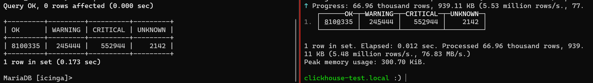


b. `60747`

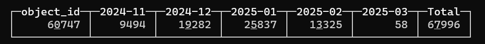

- 2 months:

  ```sql
  # ...
  WHERE object_id='60747' and state_time >= '2024-11-01 00:00:00' and state_time <= '2024-12-31 23:59:59'
  ```

  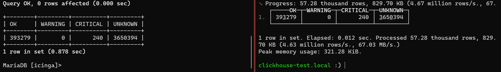

- 5 months:

  ```sql
  # ...
  WHERE object_id='60747' and state_time >= '2024-11-01 00:00:00' and state_time <= '2025-03-31 23:59:59'
  ```

  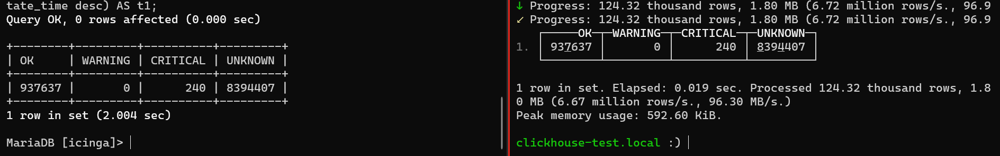

  

2. Notification History

```sql
    # Notification History
    SELECT SQL_NO_CACHE
      n.start_time as Time,
      oc.name1 as Contact,
      oh.name1 as Host,
    CASE
      WHEN n.notification_reason = 0 THEN
      CASE
          WHEN n.state = 0 THEN 'RECOVERY'
          WHEN n.state = 1 THEN 'DOWN'
          WHEN n.state = 2 THEN 'UNREACHABLE'
          ELSE n.state
      END
      WHEN n.notification_reason = 1 THEN
      CASE
        WHEN n.state = 1 THEN 'ACKNOWLEDGEMENT (DOWN)'
        WHEN n.state = 2 THEN 'ACKNOWLEDGEMENT (UNREACHABLE)'
      END
      WHEN n.notification_reason = 2 THEN
      CASE
        WHEN n.state = 0 THEN 'FLAPPINGSTART (UP)'
        WHEN n.state = 1 THEN 'FLAPPINGSTART (DOWN)'
        WHEN n.state = 2 THEN 'FLAPPINGSTART (UNREACHABLE)'
      END
      WHEN n.notification_reason = 3 THEN
      CASE
        WHEN n.state = 0 THEN 'FLAPPINGSTOP (UP)'
        WHEN n.state = 1 THEN 'FLAPPINGSTOP (DOWN)'
        WHEN n.state = 2 THEN 'FLAPPINGSTOP (UNREACHABLE)'
      END
      WHEN n.notification_reason = 5 THEN
      CASE
        WHEN n.state = 0 THEN 'DOWNTIMESTART (UP)'
        WHEN n.state = 1 THEN 'DOWNTIMESTART (DOWN)'
        WHEN n.state = 2 THEN 'DOWNTIMESTART (UNREACHABLE)'
      END
      WHEN n.notification_reason = 6 OR n.notification_reason = 7 THEN
      CASE
        WHEN n.state = 0 THEN 'DOWNTIMEEND (UP)'
        WHEN n.state = 1 THEN 'DOWNTIMEEND (DOWN)'
        WHEN n.state = 2 THEN 'DOWNTIMEEND (UNREACHABLE)'
      END
      WHEN n.notification_reason = 99 THEN
      CASE
        WHEN n.state = 0 THEN 'CUSTOM (UP)'
        WHEN n.state = 1 THEN 'CUSTOM (DOWN)'
        WHEN n.state = 2 THEN 'CUSTOM (UNREACHABLE)'
      END
    END AS Type,
      occ.name1 AS Notification_Command,
      n.output AS Infomation

    FROM
    icinga_contactnotifications c
    JOIN icinga_notifications n ON c.instance_id = n.instance_id AND c.notification_id = n.notification_id
    JOIN icinga_objects oc ON c.contact_object_id = oc.object_id
    JOIN icinga_objects oh ON n.object_id = oh.object_id
    LEFT JOIN icinga_contactnotificationmethods cn ON cn.contactnotification_id = c.contactnotification_id
    LEFT JOIN icinga_objects occ ON cn.command_object_id = occ.object_id
    WHERE n.start_time BETWEEN '2023-11-15' AND '2025-12-15' AND oh.objecttype_id = 1 AND oh.name1 in ('ME-CSR-HNI-C119.5---HN_HBT_CHUA_VUA','ME-CSR-HNI-C173.2---H2_MLH_YEN_NHAN','ME-CSR-HNI-C59.3---HN_DDA_NGO_CHIEN_THANG','ME-CSR-HNI-C85.9---HN_NTL_MY_DINH_1','ME-CSR-HNI-C39.2---HN_HKM_BA_TRIEU','ME-CSR-HNI-C25.6---HN_HBT_NGUYEN_KHOAI','ME-CSR-HNI-C118.4---HN_HBT_VTC_LAC_TRUNG_TOWER_IBC','ME-CSR-HNI-C5.5---HN_DDA_KHUONG_THUONG')
    AND n.notification_id > ((select max(notification_id) from icinga_notifications) - 400000000)
    ORDER BY n.start_time desc;
```

```sql
# Notification History ClickHouse
SELECT
  n.start_time as Time,
  oc.name1 as Contact,
  oh.name1 as Host,
  CASE
    WHEN n.notification_reason = 0 THEN
      CASE
        WHEN n.state = 0 THEN 'RECOVERY'
        WHEN n.state = 1 THEN 'DOWN'
        WHEN n.state = 2 THEN 'UNREACHABLE'
        ELSE toString(n.state)
      END
    WHEN n.notification_reason = 1 THEN
      CASE
        WHEN n.state = 1 THEN 'ACKNOWLEDGEMENT (DOWN)'
        WHEN n.state = 2 THEN 'ACKNOWLEDGEMENT (UNREACHABLE)'
        ELSE ''
      END
    WHEN n.notification_reason = 2 THEN
      CASE
        WHEN n.state = 0 THEN 'FLAPPINGSTART (UP)'
        WHEN n.state = 1 THEN 'FLAPPINGSTART (DOWN)'
        WHEN n.state = 2 THEN 'FLAPPINGSTART (UNREACHABLE)'
        ELSE ''
      END
    WHEN n.notification_reason = 3 THEN
      CASE
        WHEN n.state = 0 THEN 'FLAPPINGSTOP (UP)'
        WHEN n.state = 1 THEN 'FLAPPINGSTOP (DOWN)'
        WHEN n.state = 2 THEN 'FLAPPINGSTOP (UNREACHABLE)'
        ELSE ''
      END
    WHEN n.notification_reason = 5 THEN
      CASE
        WHEN n.state = 0 THEN 'DOWNTIMESTART (UP)'
        WHEN n.state = 1 THEN 'DOWNTIMESTART (DOWN)'
        WHEN n.state = 2 THEN 'DOWNTIMESTART (UNREACHABLE)'
        ELSE ''
      END
    WHEN n.notification_reason = 6 OR n.notification_reason = 7 THEN
      CASE
        WHEN n.state = 0 THEN 'DOWNTIMEEND (UP)'
        WHEN n.state = 1 THEN 'DOWNTIMEEND (DOWN)'
        WHEN n.state = 2 THEN 'DOWNTIMEEND (UNREACHABLE)'
        ELSE ''
      END
    WHEN n.notification_reason = 99 THEN
      CASE
        WHEN n.state = 0 THEN 'CUSTOM (UP)'
        WHEN n.state = 1 THEN 'CUSTOM (DOWN)'
        WHEN n.state = 2 THEN 'CUSTOM (UNREACHABLE)'
        ELSE ''
      END
    ELSE ''
  END AS Type,
  occ.name1 AS Notification_Command,
  n.output AS Infomation
FROM
  icinga_contactnotifications c
JOIN icinga_notifications n ON c.instance_id = n.instance_id AND c.notification_id = n.notification_id
JOIN icinga_objects oc ON c.contact_object_id = oc.object_id
JOIN icinga_objects oh ON n.object_id = oh.object_id
LEFT JOIN icinga_contactnotificationmethods cn ON cn.contactnotification_id = c.contactnotification_id
LEFT JOIN icinga_objects occ ON cn.command_object_id = occ.object_id
WHERE n.start_time BETWEEN '2023-11-15' AND '2025-12-15' 
  AND oh.objecttype_id = 1 
  AND oh.name1 in ('ME-CSR-HNI-C119.5---HN_HBT_CHUA_VUA','ME-CSR-HNI-C173.2---H2_MLH_YEN_NHAN','ME-CSR-HNI-C59.3---HN_DDA_NGO_CHIEN_THANG','ME-CSR-HNI-C85.9---HN_NTL_MY_DINH_1','ME-CSR-HNI-C39.2---HN_HKM_BA_TRIEU','ME-CSR-HNI-C25.6---HN_HBT_NGUYEN_KHOAI','ME-CSR-HNI-C118.4---HN_HBT_VTC_LAC_TRUNG_TOWER_IBC','ME-CSR-HNI-C5.5---HN_DDA_KHUONG_THUONG')
  AND n.notification_id > ((SELECT max(notification_id) FROM icinga_notifications) - 400000000)
ORDER BY n.start_time DESC SETTINGS use_query_cache = 0;
```


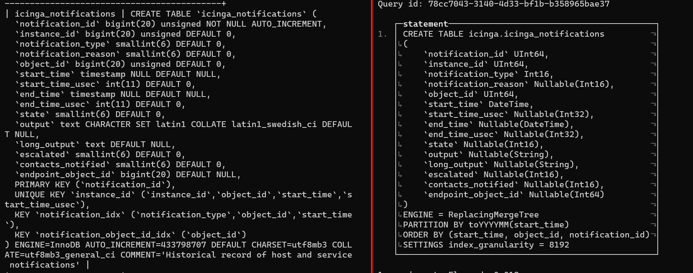


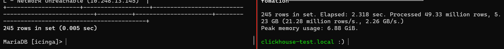


Total rows: 

```sql
SELECT * FROM
  icinga_contactnotifications c
JOIN icinga_notifications n ON c.instance_id = n.instance_id AND c.notification_id = n.notification_id
JOIN icinga_objects oc ON c.contact_object_id = oc.object_id
JOIN icinga_objects oh ON n.object_id = oh.object_id
LEFT JOIN icinga_contactnotificationmethods cn ON cn.contactnotification_id = c.contactnotification_id
LEFT JOIN icinga_objects occ ON cn.command_object_id = occ.object_id
ORDER BY n.start_time DESC;
```

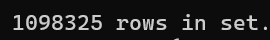


3. Alert History - Host

```sql
# Alert History - Host MariaDB 
SELECT SQL_NO_CACHE state_time as Time,   t4.name1 as Host,   t1.state AS State,   t1.state_type AS statetype,   t1.output as Description,   t1.check_source as Check_Source FROM icinga_statehistory t1 INNER JOIN icinga_hostgroup_members t2 on t1.object_id = t2.host_object_id INNER JOIN icinga_hostgroups t3 on t2.hostgroup_id = t3.hostgroup_id INNER JOIN icinga_objects t4 ON t1.object_id = t4.object_id WHERE t3.alias IN ('DBB_HPG', 'HNI') AND state_time >= '2023-11-15' AND state_time <= '2024-12-15';
```

```sql
# Alert History - Host ClickHouse
SELECT    state_time as Time,   t4.name1 as Host,   t1.state AS State,   t1.state_type AS statetype,   t1.output as Description,   t1.check_source as Check_Source FROM icinga_statehistory t1 INNER JOIN icinga_hostgroup_members t2 on t1.object_id = t2.host_object_id INNER JOIN icinga_hostgroups t3 on t2.hostgroup_id = t3.hostgroup_id INNER JOIN icinga_objects t4 ON t1.object_id = t4.object_id WHERE t3.alias IN ('DBB_HPG', 'HNI') AND state_time >= '2023-11-15' AND state_time <= '2024-12-15' SETTINGS use_query_cache = 0;
```

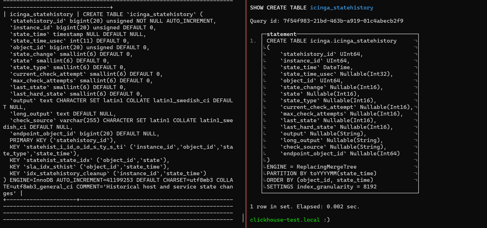


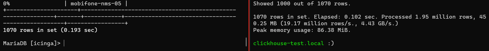

Add order by Time desc

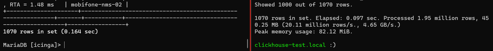

Total rows:

```sql
select count(*) FROM icinga_statehistory t1 INNER JOIN icinga_hostgroup_members t2 on t1.object_id = t2.host_object_id INNER JOIN icinga_hostgroups t3 on t2.hostgroup_id = t3.hostgroup_id INNER JOIN icinga_objects t4 ON t1.object_id = t4.object_id;
```

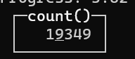


4. Alert History - Service

```sql
# Alert History - Service MariaDB
SELECT SQL_NO_CACHE state_time as Time,   t2.display_name as Host,   t3.display_name as Service,   t1.state AS State,   t1.state_type AS statetype,   t1.output as Description,   t1.check_source as Check_Source FROM icinga_statehistory t1 INNER JOIN icinga_services t2 ON t1.object_id = t2.service_object_id INNER JOIN icinga_hosts t3 ON t2.host_object_id = t3.host_object_id INNER JOIN icinga_hostgroup_members t4 ON t2.host_object_id = t4.host_object_id INNER JOIN icinga_hostgroups t5 on t4.hostgroup_id = t5.hostgroup_id WHERE t5.alias IN ('DBB_HPG', 'HNI') AND state_time >= '2023-11-15' AND state_time <= '2024-12-15' LIMIT 50000;
```

```sql
# Alert History - Service ClickHouse
SELECT    state_time as Time,   t2.display_name as Host,   t3.display_name as Service,   t1.state AS State,   t1.state_type AS statetype,   t1.output as Description,   t1.check_source as Check_Source FROM icinga_statehistory t1 INNER JOIN icinga_services t2 ON t1.object_id = t2.service_object_id INNER JOIN icinga_hosts t3 ON t2.host_object_id = t3.host_object_id INNER JOIN icinga_hostgroup_members t4 ON t2.host_object_id = t4.host_object_id INNER JOIN icinga_hostgroups t5 on t4.hostgroup_id = t5.hostgroup_id WHERE t5.alias IN ('DBB_HPG', 'HNI') AND state_time >= '2023-11-15' AND state_time <= '2024-12-15' LIMIT 50000 SETTINGS use_query_cache = 0;
```

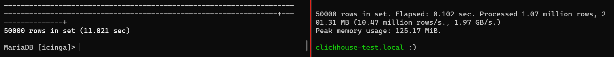


Add order by Time desc

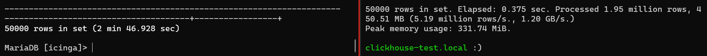


Without limit 50000:

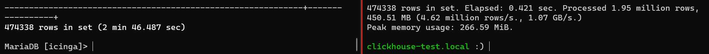


Without limit 50000 and order by Time:

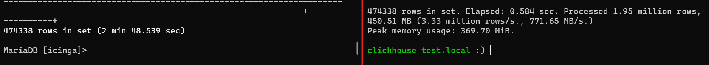


Total rows:

```sql
select count(*) FROM icinga_statehistory t1 INNER JOIN icinga_services t2 ON t1.object_id = t2.service_object_id INNER JOIN icinga_hosts t3 ON t2.host_object_id = t3.host_object_id INNER JOIN icinga_hostgroup_members t4 ON t2.host_object_id = t4.host_object_id INNER JOIN icinga_hostgroups t5 on t4.hostgroup_id = t5.hostgroup_id;
```


